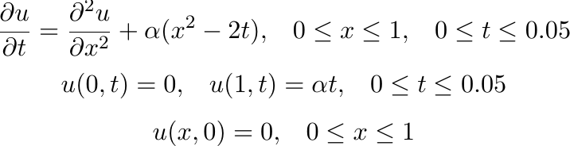
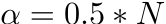

## The grid method for solving the initial-boundary value problem for the heat conduction equation

    

## Tasks: 

1. Find a solution by explicit and implicit finite difference schemes with using tridiagonal matrix algorithm, where .
