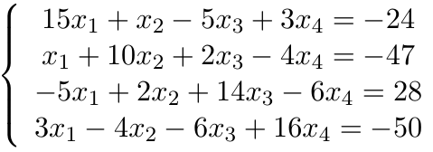
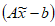
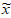
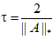
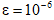
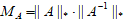

## Method LU-decomposition and simple-iteration method.

## Tasks:

1. It is required to solve the system of linear equations method LU-decomposition.
2. Calculate the residual vector , where  is the resulting solution.
3. Refine the resulting solution by the simple-iteration method with parameter  and approximation .
4. Calculate the condition number of the matrix .
