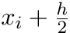
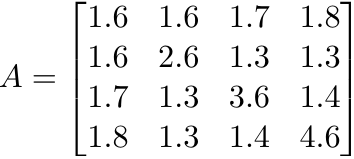

## Approximation the function. Calculation of eigenvalues and eigenvectors of matrices

## Tasks: 
1. By the method of least squares with the use of orthogonal polynomials Chebyshev, obtain a polynomial of degree 3. \
Check function values at points . Print Chebyshev polynomials.

|X|Y|
|-|-|
|0.3+0.1*N|0.5913|
|0.4+0.1*N|0.63+N/17|
|0.5+0.1*N|0.7162|
|0.6+0.1*N|0.8731|
|0.7+0.1*N|0.9574|
|0.8+0.1*N|1.8-COS(N/11)|
|0.9+0.1*N|1.3561|
|1.0+0.1*N|1.2738|
|1.1+0.1*N|1.1+N/29|
|1.2+0.1*N|1.1672|

2. Find by method Danilevsky of eigenvalues and eigenvectors of symmetric matrix.

3. Using the power-law method, estimate the spectral radius of these matrices with an approximation .
