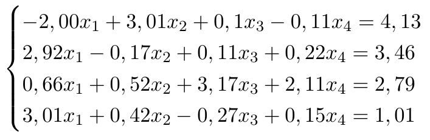
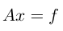
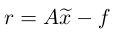
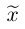
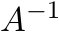

## Gaussian method with main element selection by row  

    

## Tasks: 

1. It is required to solve the system  of linear equations with the choice of the main element by rows.  
2. Calculate the residual vector , where  is the resulting solution.  
3. Calculate the determinant of a matrix using the Gaussian method.
4. Find inverse matrix  using Gaussian Method.
5. Check inverse matrix, through multiply the source matrix by the resulting inverse matrix.
