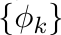
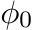

## Solve Boundary value problems by Ritz Method

    

## Tasks: 

1. System  choose as: 

*  - linear function, satisfying the boundary conditions
* 

Segment [a, b] split into 5 parts and issue a solution u(x). Print the matrix 'A', vector 'b' and 'c' solution system.

2. The problem of the numerical solution of the SLEs is solved by method Gauss. The problem of the numerical integration is solved by Simpson rule`s.
3. Consider the questions about the conditionality number of the matrix and the sign-definiteness of the matrix.
