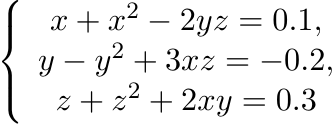
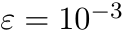
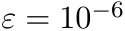

## Solving systems of nonlinear equations

    

## Tasks: 

1. Solve a system of nonlinear equations by simple-iteration method with accuracy .  
2. Solve a system of nonlinear equations by Newton method with accuracy .
